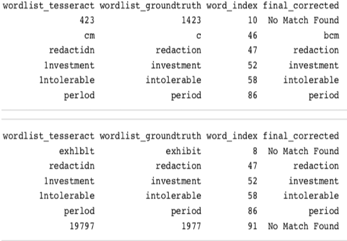

# Project: OCR (Optical Character Recognition) 


### [Full Project Description](doc/project4_desc.md)

Term: Fall 2018

+ Team # 1
+ Team members
	+ team member 1 Beers, Izzy ib2392@columbia.edu
	+ team member 2 Chen, Yang yc3335@columbia.edu
	+ team member 3 Gao, Han hg2474@columbia.edu
	+ team member 4 Qiu, Yimeng yq2231@columbia.edu
	+ team member 5 Zhai, Chun cz2466@columbia.edu


+ Project summary:  In this project, we created an OCR post-processing procedure to enhance Tesseract OCR output. We understood and discussed the assigned paper D1 and C4, for the detection algorithm and correction algorithm separately. For D1, the detection part, we use eight rules which is referenced from the rgarbage. The related code is in lib **ifcleantoken.r**
+ For C4, we used deletion, insertion, and substitution techniques to look for any possible corrections for these words. Deletion would see if deleting an unnecessary character from the word would lead to
a correctly spelled word, insertion would see if inserting an additional character into the word would lead to a
correctly spelled word, and substitution would see if replacing a character in the word with a different character
would lead to a correctly spelled word.Last we compute a score for each candidate. The final step is performance measurement. 
	
**Contribution statement**: ([default](doc/a_note_on_contributions.md)) All team members contributed equally in all stages of this project. All team members approve our work presented in this GitHub repository including this contributions statement. 
+ Beers, Izzy: Wrote get_bigrams, deletion, insertion, substitution, letter_function, calculate_frequencies, compare_more_than_one_character_off, compare_one_character_off, get_mistake_list, and print_corrections functions for the C4 code, and did the write up for the ADS_project_4_CorrectionPart.pdf markdown file.
+ Chen, Yang: Finish the coding part of D1, combine D1 and C4 together, edit the readme file
+ Gao, Han: Presenter, prepare the powerpoint, finish the coding part of D1.
+ Qiu, Yimeng: Finish the evaluation of final model.
+ Zhai, Chun: Finish the coding part of C4, test C4, and combine works to Github.

Following [suggestions](http://nicercode.github.io/blog/2013-04-05-projects/) by [RICH FITZJOHN](http://nicercode.github.io/about/#Team) (@richfitz). This folder is orgarnized as follows.

```
proj/
├── lib/
├── data/
├── doc/
├── figs/
└── output/
```

Please see each subfolder for a README file.
