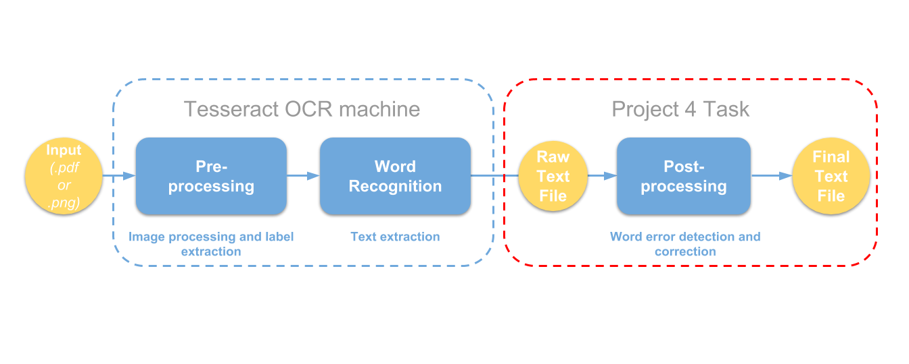

Jing Wu

GU4243/GR5243: Applied Data Science

<style type="text/css">
h1.title {
  font-size: 24px;
  color: Black;
}
h1 { /* Header 1 */
  font-size: 24px;
  color: Black;
}
h2 { /* Header 2 */
  font-size: 20px;
  color: Black;
}
h3 { /* Header 3 */
  font-size: 16px;
  color: Black;
}
h4 { /* Header 4 */
  font-size: 14px;
  color: Grey;
}
</style>
# Introduction {-}

Optical character recognition (OCR) is the process of converting scanned images of machine printed or
handwritten text (numerals, letters, and symbols), into machine readable character streams, plain (e.g. text files) or formatted (e.g. HTML files). As shown in Figure 1, the data *workflow* in a typical OCR system consists of three major stages:

* Pre-processing

* OCR character recognition

* Post-processing

 

We have processed raw scanned images through the first two steps are relying on the [Tessearct OCR machine](https://en.wikipedia.org/wiki/Tesseract_(software)). R package tutorial can be found [here](https://www.r-bloggers.com/the-new-tesseract-package-high-quality-ocr-in-r/). 

BUT this is not the FOCUS of this project!!!

In this project, we are going to **focus on the third stage -- post-processing**, which includes two tasks: *error detection* and *error correction*.  

# Step 1 - Load library and source code
```{r, warning=FALSE, message = FALSE, eval=FALSE}
if (!require("devtools")) install.packages("devtools")
if (!require("pacman")) {
  ## devtools is required
  library(devtools)
  install_github("trinker/pacman")
}

pacman::p_load(knitr, readr, stringr, tesseract, vecsets)
source('../lib/ifCleanToken.R')
file_name_vec <- list.files("../data/ground_truth") #100 files in total
```

# Step 2 - read the files and conduct Tesseract OCR

Although we have processed the Tesseract OCR and save the output txt files in the `data` folder, we include this chunk of code in order to make clear the whole pipeline to you.

```{r, eval=FALSE}
for(i in c(1:length(file_name_vec))){
  current_file_name <- sub(".txt","",file_name_vec[i])
  ## png folder is not provided on github (the code is only on demonstration purpose)
  current_tesseract_txt <- tesseract::ocr(paste("../data/png/",current_file_name,".png",sep=""))
  
  ### clean the tessetact text (separate line by "\n", delete null string, transter to lower case)
  clean_tesseract_txt <- strsplit(current_tesseract_txt,"\n")[[1]]
  clean_tesseract_txt <- clean_tesseract_txt[clean_tesseract_txt!=""]
  
  ### save tesseract text file
  writeLines(clean_tesseract_txt, paste("../data/tesseract/",current_file_name,".txt",sep=""))
}
```

# Step 3 - Error detection

Now, we are ready to conduct post-processing, based on the Tessearct OCR output. First of all, we need to detect errors, or *incorrectly processed words* -- check to see if an input string is a valid dictionary word or if its n-grams are all legal.

The referenced papers are:

1. [Rule-based techniques](http://webpages.ursinus.edu/akontostathis/KulpKontostathisFinal.pdf)

- rules are in the section 2.2 

2. [Letter n-gram](https://ieeexplore.ieee.org/stamp/stamp.jsp?tp=&arnumber=1672564)

- focus on positional binary digram in section 3-a.error detection

3. Probabilistic techniques -- [SVM garbage detection](https://dl.acm.org/citation.cfm?doid=2034617.2034626)

- features are in section 5 (you can choose not to implement ‘Levenshtein distance’ feature)


In this statercode, we implement the first three rules in the first paper -- rule based techniques, as an example.

```{r, eval=FALSE}
### only process one of the files in the folder as an example, in your project, you need to use all the files
current_file_name <- sub(".txt","",file_name_vec[5])

## read the ground truth text
current_ground_truth_txt <- readLines(paste("../data/ground_truth/",current_file_name,".txt",sep=""), warn=FALSE)

## read the tesseract text
current_tesseract_txt <- readLines(paste("../data/tesseract/",current_file_name,".txt",sep=""), warn=FALSE)
clean_tesseract_txt <- paste(current_tesseract_txt, collapse = " ")

## detect tesseract word error
tesseract_vec <- str_split(clean_tesseract_txt," ")[[1]] #1124 tokens
tesseract_if_clean <- unlist(lapply(tesseract_vec,ifCleanToken)) # source code of ifCleanToken in in lib folder
```

# Step 4 - Error correction

Given the detected word error, in order to find the best correction, we need to generating the candidate corrections: a dictionary or a database of legal n-grams to locate one or more potential correction terms. Then we need invoke some lexical-similarity measure between the misspelled string and the candidates or a probabilistic estimate of the likelihood of the correction to rank order the candidates.

The referenced papers are:

1. [Letter n-gram](https://ieeexplore.ieee.org/stamp/stamp.jsp?tp=&arnumber=1672564}{positional binary digram)

- focus on section 3-b.error correction

2. Supervised model -- [correction regressor](https://arxiv.org/pdf/1611.06950.pdf)

3. [probability scoring without context](https://link.springer.com/content/pdf/10.1007%2FBF01889984.pdf)

- focus on section 3

4. [probability scoring with contextual constraints](https://link.springer.com/content/pdf/10.1007%2FBF01889984.pdf)

- focus on section 5

5. [topic models](https://ieeexplore.ieee.org/stamp/stamp.jsp?tp=&arnumber=4377099)

Here, in our code, we just simply remove the detected-errors.

```{r, eval=FALSE}
get_wordcounts = function(pubmed)
{
  wordcounts <- termFreq(doc = pubmed$Abstract,control = list(tolower=TRUE,removePunctuation=TRUE,removeNumbers=TRUE))
  wordcounts <- sort(unclass(wordcounts),decreasing = T)
  wordcounts <- data.frame(tokens=names(wordcounts),n=as.integer(wordcounts))
  wordcounts$tokens <- reorder(wordcounts$tokens,wordcounts$n)
  return(wordcounts)
}

get_bigrams = function(text)
{
  ng <- ngram (text, n =  2)
  bigrams = data.frame(get.phrasetable(ng))
  
  bigram_counts = bigrams %>%
    separate(ngrams, c("word1", "word2"), sep = " ") %>%
    count(word1, word2, sort = TRUE)  
  
  bg = unlist(strsplit(bigrams$ngrams, " "))
  bigram_counts = matrix(bg, ncol = 2, nrow = length(bg)/2, byrow = TRUE)
  bigram_counts = data.frame(bigram_counts, bigrams$freq)
  colnames(bigram_counts) = c("word1", "word2", "freq")
  
  return(bigram_counts)
}

#deletion/insertion/correction functions:
deletion = function(word, word_before, word_after)
{
  wordList = unique(wordcounts$tokens)
  word = removePunctuation(tolower(word))
  word_before = tolower(word_before)
  word_after = tolower(word_after)
  possible_words = c()
  #print(paste("word =", word))
  for (i in 1:nchar(word))
  {
    new_word = paste(substr(word, 1, i-1), substr(word, i+1, nchar(word)), sep = "")
    #print(paste("deleting character", i, "..."))
    if (new_word %in% wordList)
    {
      #print(paste("Found Word:", new_word))
      possible_words = rbind(possible_words, calculate_frequencies(new_word, word_before, word_after))
    }
    else
    {
      #print("No Words Found")
    }
  }
  if (nrow(data.frame(possible_words))!=0)
  {
    colnames(possible_words) = c("word", "word_freq", "left_neighbor_freq", "right_neighbor_freq")
    possible_words = data.frame(possible_words)
    possible_words$word = as.character(possible_words$word)
    possible_words$word_freq = as.numeric(as.character(possible_words$word_freq))
    possible_words$left_neighbor_freq = as.numeric(as.character(possible_words$left_neighbor_freq))
    possible_words$right_neighbor_freq = as.numeric(as.character(possible_words$right_neighbor_freq))
  }
  else
  {
    possible_words = data.frame(t(c("No Match Found", NA, NA, NA)))
    colnames(possible_words) = c("word", "word_freq", "left_neighbor_freq", "right_neighbor_freq")
  }
  return(possible_words)
}

letter_function = function(letter, index, word, type)
{
  wordList = unique(wordcounts$tokens)
  if (type == "insertion")
  {
    new_word = paste(substr(word,1,index-1),letter,substr(word, index, nchar(word)), sep = "")
    if (new_word %in% tolower(wordList))
      return(new_word)
  }
  else if (type == "substitution")
  {
    new_word = paste(substr(word,1,index-1),letter,substr(word, index + 1, nchar(word)), sep = "")
    if (new_word %in% tolower(wordList))
      return(new_word)
  }
  else
  {
    #print("error: 'type' must be insertion or substitution")
  }
}

calculate_frequencies = function(word, before_word, after_word)
{
  wordList = unique(wordcounts$tokens)
  if (word %in% tolower(wordList))
  {
    prior = wordcounts[wordcounts$token == word,]$n
    left_neighbor = ifelse(!is.na(before_word),bigram_counts[bigram_counts$word1 == before_word & bigram_counts$word2 == word,]$freq, "None")
    right_neighbor = ifelse(!is.na(after_word), bigram_counts[bigram_counts$word2 == after_word & bigram_counts$word1 == word,]$freq, "None")
    left_neighbor = ifelse(is.null(left_neighbor), 0, left_neighbor)
    right_neighbor = ifelse(is.null(right_neighbor), 0, right_neighbor)
    left_neighbor = ifelse(is.na(left_neighbor), 0, left_neighbor)
    right_neighbor = ifelse(is.na(right_neighbor), 0, right_neighbor)
    left_neighbor = ifelse(left_neighbor == "None", NA, left_neighbor)
    right_neighbor = ifelse(right_neighbor == "None", NA, right_neighbor)
  }
  return(c(as.character(word),as.numeric(prior),as.numeric(left_neighbor),as.numeric(right_neighbor)))
}

insertion = function(word, word_before, word_after)
{
  word = removePunctuation(tolower(word))
  word_before = removePunctuation(tolower(word_before))
  word_after = removePunctuation(tolower(word_after))
  possible_words = c()
  #print(paste("word = ", word))
  #print("--------")
  for (i in 1:(nchar(word) + 1))
  {
    #print(paste("inserting letters into position",i))
    new_words = data.frame(unlist(sapply(letters, letter_function, i, word, "insertion")))
    if (nrow(new_words)!=0)
    {
      colnames(new_words) = "word"
      new_words = unlist(as.character(new_words$word))
      #print(paste("Word found:", paste(new_words)))
      freq = sapply(new_words, calculate_frequencies, word_before, word_after)
      possible_words = rbind(possible_words, t(freq))
    }
    else
    {
      #print("No words found")
    }
    #print("--------")
    
  }
  if (nrow(data.frame(possible_words))!=0)
  {
    possible_words = matrix(unlist(possible_words), nrow = length(unlist(possible_words))/4, ncol = 4, byrow = FALSE)
    colnames(possible_words) = c("word", "word_freq", "left_neighbor_freq", "right_neighbor_freq")
    possible_words = data.frame(possible_words)
    possible_words$word = as.character(possible_words$word)
    possible_words$word_freq = as.numeric(as.character(possible_words$word_freq))
    possible_words$left_neighbor_freq = as.numeric(as.character(possible_words$left_neighbor_freq))
    possible_words$right_neighbor_freq = as.numeric(as.character(possible_words$right_neighbor_freq))
  }
  else
  {
    possible_words = data.frame(t(c("No Match Found", NA, NA, NA)))
    colnames(possible_words) = c("word", "word_freq", "left_neighbor_freq", "right_neighbor_freq")
  }
  return(possible_words)
}

substitution = function(word, word_before, word_after)
{
  possible_words = c()
  word = removePunctuation(tolower(word))
  word_before = removePunctuation(tolower(word_before))
  word_after = removePunctuation(tolower(word_after))
  #print(paste("word = ", word))
  #print("--------")
  for (i in 1:nchar(word))
  {
    #print(paste("replacing position",i, "with various letters"))
    new_words = data.frame(unlist(sapply(letters, letter_function, i, word, "substitution")))
    if (nrow(new_words)!=0)
    {
      colnames(new_words) = "word"
      new_words = unlist(as.character(new_words$word))
      #print(paste("Word found:", paste(new_words)))
      freq = sapply(new_words, calculate_frequencies, word_before, word_after)
      possible_words = rbind(possible_words, t(freq))
    }
    else
    {
      #print("No words found")
    }
    #print("--------")
    
  }
  if (nrow(data.frame(possible_words))!=0)
  {
    possible_words = matrix(unlist(possible_words), nrow = length(unlist(possible_words))/4, ncol = 4, byrow = FALSE)
    colnames(possible_words) = c("word", "word_freq", "left_neighbor_freq", "right_neighbor_freq")
    possible_words = data.frame(possible_words)
    possible_words$word = as.character(possible_words$word)
    possible_words$word_freq = as.numeric(as.character(possible_words$word_freq))
    possible_words$left_neighbor_freq = as.numeric(as.character(possible_words$left_neighbor_freq))
    possible_words$right_neighbor_freq = as.numeric(as.character(possible_words$right_neighbor_freq))
  }
  else
  {
    possible_words = data.frame(t(c("No Match Found", NA, NA, NA)))
    colnames(possible_words) = c("word", "word_freq", "left_neighbor_freq", "right_neighbor_freq")
  }
  return(possible_words)
  
}

#SPELLING CORRECTION FUNCTIONS

#compares based on a maximum of 30% of letters being wrong:
compare_more_than_one_character_off = function(correct_wordlist, wrong_wordlist, word_num, range)
{
  #print(paste("Word number:", word_num, "of", length(wrong_wordlist)))
  word = tolower(wrong_wordlist[word_num])
  #print(paste("Word:",word))
  if (word_num - range > length(correct_wordlist))
  {
    #print("Out of range")
    return("Out of range")
  }
  range1 = min(word_num - 1, range)
  #print(paste("range1", range1))
  range2 = min(length(correct_wordlist) - word_num, range)
  #print(paste("range2", range2))
  #print("--------")
  comparisons = tolower(correct_wordlist[(word_num-range1):(word_num+range2)])
  #print("Comparisons:")
  #print(comparisons)
  if (word %in% comparisons)
  { 
    #print("Word Found. Correct")
    #print("--------")
    #print("--------")
    return("Correct")
  }
  else 
  {
    if (nchar(word) == 1)
    {
      #print("No close matches")
      return("No close matches")
    }
    #print("Word not found.  Seeing if any of the comparisons are similar.")
    min = Inf
    for (w in comparisons)
    {
      if (adist(word, w) < min)
      {
        min = adist(word, w)
        match = w
        #print(paste("new match", match))
      }
      
    }
    #print(paste("Comparison number:",0.3*nchar(word)))
    if (min < 0.3*nchar(word))
    {
      #print(paste("Match:", match))
      #print("--------")
      #print("--------")
      return(match)
    }
    else
    {
      #print("No close matches")
      #print("--------")
      #print("--------")
      return("No close matches")
    }
  }
}

#compares based on only being off by one character (words where insertion, deletion, and substitution can be used)
compare_one_character_off = function(correct_wordlist, wrong_wordlist, word_num, range)
{
  #print(paste("Word number:", word_num, "of", length(wrong_wordlist)))
  word = removePunctuation(tolower(wrong_wordlist[word_num]))
  #print(paste("Word:",word))
  if (word_num - range > length(correct_wordlist))
  {
    #print("Out of range")
    return("Out of range")
  }
  range1 = min(word_num - 1, range)
  #print(paste("range1", range1))
  range2 = min(length(correct_wordlist) - word_num, range)
  #print(paste("range2", range2))
  #print("--------")
  comparisons = tolower(correct_wordlist[(word_num-range1):(word_num+range2)])
  #print("Comparisons:")
  #print(comparisons)
  if (word %in% comparisons)
  { 
    #print("Word Found. Correct")
    #print("--------")
    #print("--------")
    return("Correct")
  }
  else 
  {
    if (nchar(word) == 1)
    {
      #print("No close matches")
      return("No close matches")
    }
    #print("Word not found.  Seeing if any of the comparisons are similar.")
    min = Inf
    for (w in comparisons)
    {
      if (adist(word, w) < min)
      {
        min = adist(word, w)
        #print(paste("new min", min))
        match = w
        #print(paste("new match", match))
      }
    }
    #print(paste("Comparison number:",0.7*nchar(word)))
    if (min == 1)
    {
      #print(paste("Match:", match))
      #print("--------")
      #print("--------")
      return(match)
    }
    else
    {
      #print("No Close Matches")
      #print("--------")
      #print("--------")
      return("No close matches")
    }
  }
}

get_mistake_list = function(paper_num, r)
{
  #find the wordlist of the first groundtruth paper
  List_groundtruth <<- strsplit(groundtruth[paper_num], " ")
  wordlist_groundtruth=removePunctuation(tolower(unlist(List_groundtruth)))
  
  #find the wordlist for the first tesseract paper
  List_tesseract <<- strsplit(tesseract[paper_num], " ")
  wordlist_tesseract=removePunctuation(tolower(unlist(List_tesseract)))
  
  t = length(wordlist_tesseract)
  word_index = 1:t
  
  corrections_1= unlist(sapply(1:t, compare_one_character_off, correct_wordlist = wordlist_groundtruth, wrong_wordlist = wordlist_tesseract, range = r))
  df_1 = data.frame(wordlist_tesseract, corrections_1, word_index)
  all_incorrect_1 = df_1[df_1$corrections_1 != "Correct",]
  found_matches_1 = all_incorrect_1[all_incorrect_1$corrections_1 != "No close matches",]
  found_matches_1 = found_matches_1[found_matches_1$corrections_1 != "Out of range",]
  colnames(found_matches_1) = c("wordlist_tesseract", "wordlist_groundtruth", "word_index")
  
  corrections_2= unlist(sapply(1:t, compare_more_than_one_character_off, correct_wordlist = wordlist_groundtruth, wrong_wordlist = wordlist_tesseract, range = r))
  df_2 = data.frame(wordlist_tesseract, corrections_2, word_index)
  all_incorrect_2 = df_2[df_2$corrections_2 != "Correct",]
  found_matches_2 = all_incorrect_2[all_incorrect_2$corrections_2 != "No close matches",]
  found_matches_2 = found_matches_2[found_matches_2$corrections_2 != "Out of range",]
  colnames(found_matches_2) = c("wordlist_tesseract", "wordlist_groundtruth", "word_index")
  
  return(list(found_matches_1, found_matches_2))
}

print_corrections = function(mistakes_df)
{
  #APPLY CORRECTIONS TO DELETION
  deletion_corrections = matrix(NA, nrow = nrow(mistakes_df), ncol = 6)
  colnames(deletion_corrections) = c("wrong_word", "word", "word_freq", "left_neighbor_freq", "right_neighbor_freq", "deletion_mean")
  for (i in 1:length(mistakes_df$wordlist_tesseract))
  {
    #print(class(deletion_corrections))
    wrong_word = as.character(mistakes_df$wordlist_tesseract[i])
    #print(paste("i =", i))
    #print(paste("Word = ", wrong_word))
    num = mistakes_df$word_num[i]
    #print(paste("Word num:", num))
    left_neighbor = ifelse(num!=1, as.character(mistakes_df$wordlist_tesseract[num - 1]), NA)
    #print(paste("Left neighbor:", left_neighbor))
    right_neighbor = ifelse(num!=length(mistakes_df$wordlist_tesseract),as.character(mistakes_df$wordlist_tesseract[num + 1]), NA)
    #print(paste("Right neighbor:", right_neighbor))
    del = deletion(wrong_word, left_neighbor, right_neighbor)
    del = cbind(wrong_word, del)
    if (!is.na(del$word_freq))
    {
      optimal_del = as.matrix(del[which.min(apply(del[,3:5],1,mean)),])
      deletion_mean = mean(as.numeric(optimal_del[,3:5]))
      
    }
    else
    {
      optimal_del = as.matrix(del)
      deletion_mean = NA
    }
    deletion_corrections[i,] = c(optimal_del[1,], deletion_mean)
    
    
    #print(class(optimal_del))
    #print("---------")
  }
  deletion_corrections = data.frame(deletion_corrections)
  deletion_corrections$word = as.character(deletion_corrections$word)
  deletion_corrections$word_freq = as.numeric(as.character(deletion_corrections$word_freq))
  deletion_corrections$left_neighbor_freq = as.numeric(as.character(deletion_corrections$left_neighbor_freq))
  deletion_corrections$right_neighbor_freq = as.numeric(as.character(deletion_corrections$right_neighbor_freq))
  deletion_corrections$deletion_mean = as.numeric(as.character(deletion_corrections$deletion_mean))
  
  #APPLY CORRECTIONS TO INSERTION
  insertion_corrections = matrix(NA, nrow = nrow(mistakes_df), ncol = 6)
  colnames(insertion_corrections) = c("wrong_word", "word", "word_freq", "left_neighbor_freq", "right_neighbor_freq", "insertion_mean")
  for (i in 1:length(mistakes_df$wordlist_tesseract))
  {
    wrong_word = as.character(mistakes_df$wordlist_tesseract[i])
    #print(paste("i =", i))
    #print(paste("Word = ", wrong_word))
    num = mistakes_df$word_num[i]
    #print(paste("Word num:", num))
    left_neighbor = ifelse(num!=1, as.character(mistakes_df$wordlist_tesseract[num - 1]), NA)
    #print(paste("Left neighbor:", left_neighbor))
    right_neighbor = ifelse(num!=length(mistakes_df$wordlist_tesseract),as.character(mistakes_df$wordlist_tesseract[num + 1]), NA)
    #print(paste("Right neighbor:", right_neighbor))
    ins = insertion(wrong_word, left_neighbor, right_neighbor)
    ins = cbind(wrong_word, ins)
    if (!is.na(ins$word_freq))
    {
      optimal_ins = as.matrix(ins[which.min(apply(ins[,3:5],1,mean)),])
      insertion_mean = mean(as.numeric(optimal_ins[,3:5]))
      
    }
    else
    {
      optimal_ins = as.matrix(ins)
      insertion_mean = NA
    }
    insertion_corrections[i,] = c(optimal_ins[1,], insertion_mean)
    #print("---------")
  }
  insertion_corrections = data.frame(insertion_corrections)
  insertion_corrections$word = as.character(insertion_corrections$word)
  insertion_corrections$word_freq = as.numeric(as.character(insertion_corrections$word_freq))
  insertion_corrections$left_neighbor_freq = as.numeric(as.character(insertion_corrections$left_neighbor_freq))
  insertion_corrections$right_neighbor_freq = as.numeric(as.character(insertion_corrections$right_neighbor_freq))
  insertion_corrections$insertion_mean = as.numeric(as.character(insertion_corrections$insertion_mean))
  
  #APPLY CORRECTIONS TO SUBSTITUTION
  substitution_corrections = matrix(NA, nrow = nrow(mistakes_df), ncol = 6)
  colnames(substitution_corrections) = c("wrong_word", "word", "word_freq", "left_neighbor_freq", "right_neighbor_freq", "substitution_mean")
  for (i in 1:length(mistakes_df$wordlist_tesseract))
  {
    wrong_word = as.character(mistakes_df$wordlist_tesseract[i])
    #print(paste("i =", i))
    #print(paste("Word = ", wrong_word))
    num = mistakes_df$word_num[i]
    #print(paste("Word num:", num))
    left_neighbor = ifelse(num!=1, as.character(mistakes_df$wordlist_tesseract[num - 1]), NA)
    #print(paste("Left neighbor:", left_neighbor))
    right_neighbor = ifelse(num!=length(mistakes_df$wordlist_tesseract),as.character(mistakes_df$wordlist_tesseract[num + 1]), NA)
    #print(paste("Right neighbor:", right_neighbor))
    sub = substitution(wrong_word, left_neighbor, right_neighbor)
    sub = cbind(wrong_word, sub)
    if (!is.na(sub$word_freq))
    {
      optimal_sub = as.matrix(sub[which.min(apply(sub[,3:5],1,mean)),])
      substitution_mean = mean(as.numeric(optimal_sub[,3:5]))
      
    }
    else
    {
      optimal_sub = as.matrix(sub)
      substitution_mean = NA
    }
    substitution_corrections[i,] = c(optimal_sub[1,], substitution_mean)
    #print("---------")
  }
  substitution_corrections = data.frame(substitution_corrections)
  substitution_corrections$word = as.character(substitution_corrections$word)
  substitution_corrections$word_freq = as.numeric(as.character(substitution_corrections$word_freq))
  substitution_corrections$left_neighbor_freq = as.numeric(as.character(substitution_corrections$left_neighbor_freq))
  substitution_corrections$right_neighbor_freq = as.numeric(as.character(substitution_corrections$right_neighbor_freq))
  substitution_corrections$substitution_mean = as.numeric(as.character(substitution_corrections$substitution_mean))
  
  merged = cbind(deletion_corrections[,c(1,2,6)], insertion_corrections[,c(2,6)],substitution_corrections[,c(2,6)])
  colnames(merged) = c("wordlist_tesseract", "deletion_correction", "deletion_mean", "insertion_correction", "insertion_mean", "substitution_correction", "substitution_mean")
  return(merged)
}

choose_best_corrections = function(mydata)
{
  corrected=c()
  for(i in 1:nrow(mydata)){
    if(all(is.na(c(mydata[i,]$deletion_mean,mydata[i,]$insertion_mean,mydata[i,]$substitution_mean)))==FALSE){
      mydata[i,is.na(mydata[i,])] <- 0
      if(max(c(mydata[i,]$deletion_mean,mydata[i,]$insertion_mean,mydata[i,]$substitution_mean))==mydata[i,]$deletion_mean){
        corrected=c(corrected,as.character(mydata[i,]$deletion_correction))
      }
      else if(max(c(mydata[i,]$deletion_mean,mydata[i,]$insertion_mean,mydata[i,]$substitution_mean))==mydata[i,]$insertion_mean){
        corrected=c(corrected,as.character(mydata[i,]$insertion_correction))
      }
      else if(max(c(mydata[i,]$deletion_mean,mydata[i,]$insertion_mean,mydata[i,]$substitution_mean))==mydata[i,]$substitution_mean){
        corrected=c(corrected,as.character(mydata[i,]$substitution_correction))
      }
    }
    else{
      corrected=c(corrected,"No Match Found")
    }
  }
  return(corrected)
}

get_finalized_df = function(df_groundtruth, df_predictions, vector_corrections)
{
  df_predictions$final_corrected<-vector_corrections
  colnames(df_predictions)[1] <- "wordlist_tesseract"
  df_predictions$wordlist_tesseract<-as.character(df_predictions$wordlist_tesseract)
  df_groundtruth$wordlist_tesseract<-as.character(df_groundtruth$wordlist_tesseract)
  new_df<-cbind(df_groundtruth,df_predictions[,c(1,8)])
  new_df<-new_df[!duplicated(new_df$wordlist_tesseract),]
  new_df<-new_df[,-4]
  colnames(new_df)[4]<-"final_corrected"
  return(new_df)
}

get_percentage = function(finalized_df)
{
  percentage_corrected<-sum(finalized_df[,2]==as.character(finalized_df[,4]))/nrow(finalized_df)
  return(percentage_corrected)
}
```


```{r, warning = FALSE, message = FALSE, eval=FALSE}
library(tm)
library(tidyr)
library(dplyr)
library(tidytext)
library (ngram)

##READING THE DATA
group_1 =  as.character(c("05", 10, 13, 18, 21, 31, 35, 43, 49, 53))
group_2 = c(as.character(c("04","05",15:18, 34:37, 42, 43, 47, 48)), "50_1", "50_2", as.character(c(55, 59, 60:62, 69:71, 80, 81, 96, 97)))
group_3 = c("43_1", "43_2", "43_3")
group_4 = c(sapply("03_", paste, 1:7, sep = ""), sapply("06_", paste, 1:7, sep = ""), sapply("09_", paste, 1:8, sep = ""), sapply("13_", paste, 1:5, sep = ""))

group_5 = c(sapply("03_", paste, 1:10, sep = ""),sapply("09_", paste, 1:13, sep = ""), sapply("12_", paste, 1:9, sep = ""))

groups = list(group_1, group_2, group_3, group_4, group_5)

groundtruth = c()
for (g in 1:5)
{
  for (file_extension in groups[[g]])
  {
     file = readLines(paste("./Fall2018-Project4-sec2--sec2proj4_grp1/data/ground_truth/group", g, "_000000",file_extension,".txt", sep=""))
     groundtruth = paste(groundtruth, file)
  }
}

tesseract = c()
for (g in 1:5)
{
  for (file_extension in groups[[g]])
  {
    file = readLines(paste("./Fall2018-Project4-sec2--sec2proj4_grp1/data/tesseract/group", g, "_000000",file_extension,".txt", sep=""))
    tesseract = paste(tesseract, file)
  }
}


# cut to ngramms for dataframe example
txt <- strwrap(x = groundtruth,width = 20)
# create some data frame
pubmed_data <- data.frame(Title=abbreviate(names.arg = txt,minlength = 5,method = "left.kept",named = F),
                          Abstract=txt,stringsAsFactors = F)
```

After reading in the data, we first look at the word frequencies and the bigram frequencies.
```{r, warning = FALSE, message = FALSE, eval=FALSE}
wordcounts = get_wordcounts(pubmed_data)
head(wordcounts)
bigram_counts = get_bigrams(groundtruth)
head(bigram_counts)
```

Then, we want to look for differences between tesseract and groundtruth spelling. Since the number of words in each are not exactly the same and the word indices do not match up, we can't just compare spelling based on a given word index.  The idea is to look for words near that word index.  For example, if we want to see if word number twelve in tesseract is spelled correctly, we are not going to just look at word number twelve in groundtruth because it may not match up, but we are going to look at words within a given window of word number twelve.  If the same word is found with the same spelling in that window, then the word is spelled correctly.  If a word is found with a similar spelling in that window, then the word is flagged as being misspelled.  If no similar word is found, then "No Match Found" is returned; this could be because the word is so badly misspelled that it is too far off from the match, or the word itself was a mistake and was taken out in groundtruth. 

The function get_mistake_list takes in a paper number (there are multiple papers in the dataset, but due to run time constraints we do not use all of them, so the paper number specifies which paper to use), and a range.  This range is determined by how big the search window will be.  We decided that 6 was a good number: so the search window would be 6 words before and after the word index.  

The function takes each word and puts it in one of four categories:   
1. Spelled correctly (exact spelling match was found)  
2. A match was found with different spelling (word is misspelled)  
3. No match was found  
4. Index was out of range (in some cases the tesseract data is larger than groundtruth, so the last few indices are too far from the groundtruth indices).  

The function chooses only the words in scenario number two, and prints the pair of words along with the word location in tesseract.

As I mentioned before, we are calculating two different accuracies (words that are only one character off, and words more than one character off).  So one dataframe shows all pairs of words that only differ by one character, and the other dataframe shows all pairs of words that differ by at most 30% of the number of characters in the word.
```{r, warning = FALSE, message = FALSE, eval=FALSE}
papers = c(1,2)
mistakes_one_character_off = c()
mistakes_more_than_one_character_off = c()
for (p in papers)
{
  mistakes_one_character_off = data.frame(rbind(mistakes_one_character_off, get_mistake_list(p,6)[[1]]))
  mistakes_more_than_one_character_off = data.frame(rbind(mistakes_more_than_one_character_off, get_mistake_list(p, 6)[[2]]))
}
head(mistakes_one_character_off)
head(mistakes_more_than_one_character_off)
```

Now that we have all the words that need to be corrected, we call the function print_corrections, which will apply deletion, insertion, and substitution.  First it takes the dataframe calculated previously. The deletion, insertion, and substitution functions take the misspelled word, and the two neighboring words (which are found using the word_index in the dataframe calculated previously), and finds all existing words using that technique. Then each word is "scored" by the average of its word frequency and its bigram frequencies (using the left and right neighbors).  The word with the highest score is chosen.  Therefore, each word has at most one potential correction for each technique.

Again, this is calculated on the words off by one character, and the words off by more than one character.
For each dataframe, "wordlist_tesseract" is the misspelled words; "deletion_correction", "insertion_mean", and "substitution_correction" are the "highest scoring" corrections; and "deletion_mean", "insertion_mean", and "substitution_mean" are the "scores" for that correction.
```{r, warning = FALSE, message = FALSE, eval=FALSE}
all_corrections_more_than_one_character_off = print_corrections(mistakes_df = mistakes_more_than_one_character_off)
all_corrections_one_character_off = print_corrections(mistakes_df = mistakes_one_character_off)
all_corrections_more_than_one_character_off[17:27,]
all_corrections_one_character_off[11:20,]
```

Next, the choose_best_corrections function is called, which takes each word and decides whether the deletion correction, insertion correction, or substitution correction should be used, based on whichever one has the highest "score".  The function takes in the previous dataframe, and returns a vector of the chosen corrections.
```{r, eval=FALSE}
best_corrections_one_character_off = choose_best_corrections(all_corrections_one_character_off)
best_corrections_more_than_one_character_off = choose_best_corrections(all_corrections_more_than_one_character_off)
best_corrections_one_character_off[17:27]
best_corrections_more_than_one_character_off[11:20]
```
The get_finalized_df function takes the dataframe that showed the misspelled pairings, and adds a column of the corrections calculated above. 
```{r, warning = FALSE, message = FALSE, eval=FALSE}
finalized_one_character_off = get_finalized_df(mistakes_one_character_off, all_corrections_one_character_off, best_corrections_one_character_off)
finalized_more_than_one_character_off = get_finalized_df(mistakes_more_than_one_character_off, all_corrections_more_than_one_character_off, best_corrections_more_than_one_character_off)
head(finalized_one_character_off)
head(finalized_more_than_one_character_off)
```
```{r, warning = FALSE, message = FALSE, eval=FALSE}
percentage_one_character_off = get_percentage(finalized_one_character_off)
percentage_more_than_one_character_off = get_percentage(finalized_more_than_one_character_off)
```


# Step 5 - Performance measure

The two most common OCR accuracy measures are precision and recall. Both are relative measures of the OCR accuracy because they are computed as ratios of the correct output to the total output (precision) or input (recall). More formally defined,
\begin{align*}
\mbox{precision}&=\frac{\mbox{number of correct items}}{\mbox{number of items in OCR output}}\\
\mbox{recall}&=\frac{\mbox{number of correct items}}{\mbox{number of items in ground truth}}
\end{align*}
where *items* refer to either characters or words, and ground truth is the original text stored in the plain text file. 

Both *precision* and *recall* are mathematically convenient measures because their numeric values are some decimal fractions in the range between 0.0 and 1.0, and thus can be written as percentages. For instance, recall is the percentage of words in the original text correctly found by the OCR engine, whereas precision is the percentage of correctly found words with respect to the total word count of the OCR output. Note that in the OCR-related literature, the term OCR accuracy often refers to recall.

Here, we only finished the **word level evaluation** criterions, you are required to complete the **letter-level** part.

```{r, eval=FALSE}
ground_truth_vec <- str_split(paste(current_ground_truth_txt, collapse = " ")," ")[[1]] #1078
old_intersect_vec <- vecsets::vintersect(tolower(ground_truth_vec), tolower(tesseract_vec)) #607
new_intersect_vec <- vecsets::vintersect(tolower(ground_truth_vec), tolower(tesseract_delete_error_vec)) #600

OCR_performance_table <- data.frame("Tesseract" = rep(NA,4),
                                    "Tesseract_with_postprocessing" = rep(NA,4))
row.names(OCR_performance_table) <- c("word_wise_recall","word_wise_precision",
                                                 "character_wise_recall","character_wise_precision")
OCR_performance_table["word_wise_recall","Tesseract"] <- length(old_intersect_vec)/length(ground_truth_vec)
OCR_performance_table["word_wise_precision","Tesseract"] <- length(old_intersect_vec)/length(tesseract_vec)
OCR_performance_table["word_wise_recall","Tesseract_with_postprocessing"] <- length(new_intersect_vec)/length(ground_truth_vec)
OCR_performance_table["word_wise_precision","Tesseract_with_postprocessing"] <- length(new_intersect_vec)/length(tesseract_delete_error_vec)
kable(OCR_performance_table, caption="Summary of OCR performance")
```

```{r, eval=FALSE}
levelinter <- function(data){
  C_inter <- 0
  for (i in 1:dim(data)[1]){
  if (data[i,4]=="No Match Found"){
    C_inter <- CE+0
  }
  else{
    gt <- unlist(strsplit(data[i,2],split=''))
    cr <- unlist(strsplit(data[i,4],split=''))
    C_inter <- C_error + length(intersect(gt,cr))
  }
  }
  return(C_inter)
}
#data$corrections <- as.character(data$corrections)
#correctlist <- removePunctuation(data$final_corrected[data$final_corrected!='No Match Found'])
groundtruth_vect <- ground_list  
postprocess_vect <- post_list  
df <- read.csv('word_pos.csv')
load('data.RData')
C_groudtruth <- nchar(paste(groundtruth_vect, collapse=''))  
C_tesseract <- nchar(paste(df$wordlist_tesseract, collapse=''))
C_postprocessing <- nchar(paste(df$wordlist_tesseract[df$combined_if==FLASE], collapse=''))
inter_before <- vecsets::vintersect(tolower(groundtruth_vect), tolower(df$wordlist_tesseract))
inter_after <- vecsets::vintersect(tolower(groundtruth_vect), tolower(postprocess_vect))
n1 <- nchar(paste(inter_before, collapse=''))
n2 <- nchar(paste(inter_after, collapse=''))
#n_detect <- length(new_all_mistakes_with_matches_before$final_corrected[new_all_mistakes_with_matches_before$final_correcte!='No Match Found'])
#n_detectpost <- length(new_all_mistakes_with_matches$final_corrected[new_all_mistakes_with_matches$final_correcte!='No Match Found'])
n_detect <- levelinter(datapost)
n_detectpost <- levelinter(dataprocess)
# without processing
precision <- (n1+ n_detect)/C_tesseract
recall <- (n1 + n_detect)/C_groudtruth
# with processing
#List_groundtruth <- strsplit(groundtruth[paper_num], " ")
#List_tesseract <- strsplit(tesseract[paper_num], " ")
#C_groudtruth <- length(List_groundtruth)
#C_ocr <- length(List_tesseract)
#C_inter <- length(get_mistake_list)
  
precision <- (n2 + n_detectpost)/C_postprocessing
recall <- (n2 + n_detectpost)/C_groudtruth
```

Besides the above required measurement, you are encouraged the explore more evaluation measurements. Here are some related references:

1. Karpinski, R., Lohani, D., & Belaïd, A. *Metrics for Complete Evaluation of OCR Performance*. [pdf](https://csce.ucmss.com/cr/books/2018/LFS/CSREA2018/IPC3481.pdf)

- section 2.1 Text-to-Text evaluation

2. Mei, J., Islam, A., Wu, Y., Moh'd, A., & Milios, E. E. (2016). *Statistical learning for OCR text correction*. arXiv preprint arXiv:1611.06950. [pdf](https://arxiv.org/pdf/1611.06950.pdf)

- section 5, separate the error detection and correction criterions

3. Belaid, A., & Pierron, L. (2001, December). *Generic approach for OCR performance evaluation*. In Document Recognition and Retrieval IX (Vol. 4670, pp. 203-216). International Society for Optics and Photonics. [pdf](https://members.loria.fr/ABelaid/publis/spie02-belaid-pierron.pdf)

- section 3.2, consider the text alignment

# References {-} 

1. Borovikov, E. (2014). *A survey of modern optical character recognition techniques*. arXiv preprint arXiv:1412.4183.[pdf](https://pdfs.semanticscholar.org/79c9/cc90b8c2e2c9c54c3862935ea00df7dd56ed.pdf)
(This paper is the source of our evaluation criterion)

2. Kukich, K. (1992). *Techniques for automatically correcting words in text*. Acm Computing Surveys (CSUR), 24(4), 377-439. [pdf](http://www.unige.ch/eti/ptt/docs/kukich-92.pdf)
(This paper is the benchmark review paper)